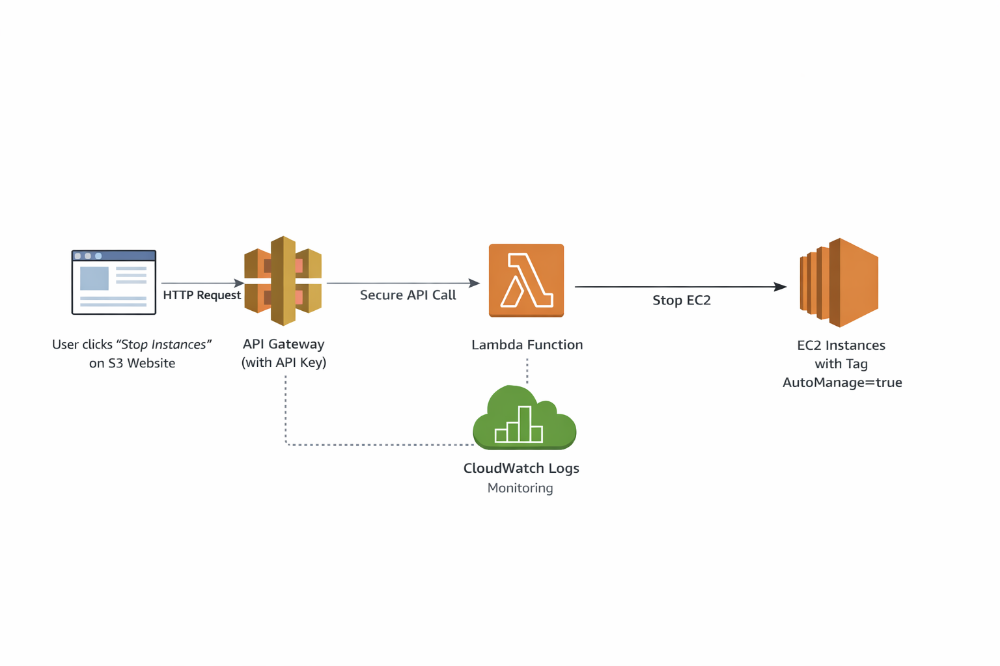
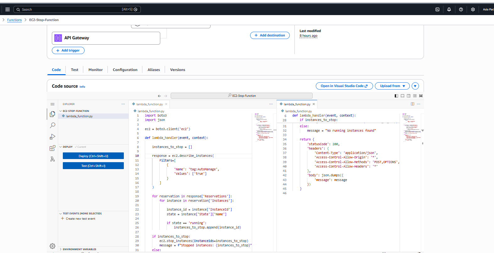
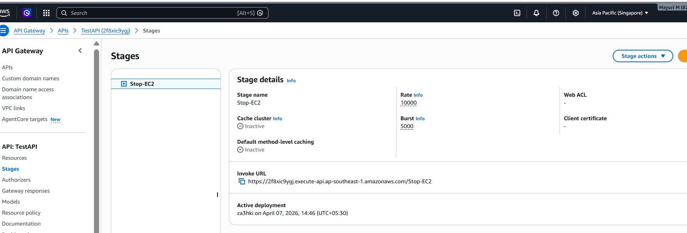
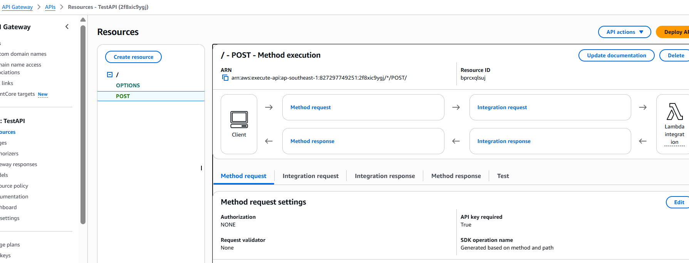
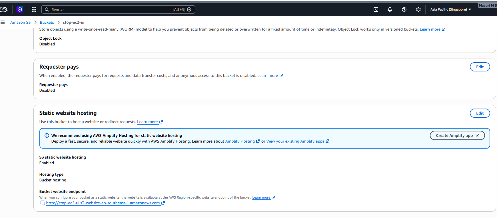
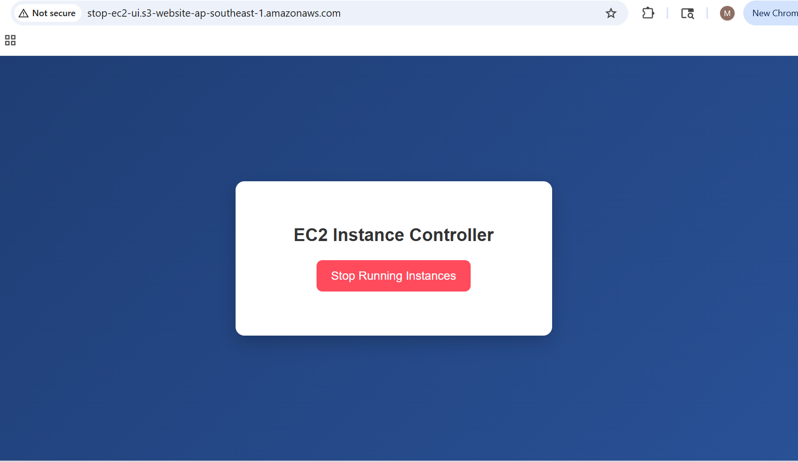
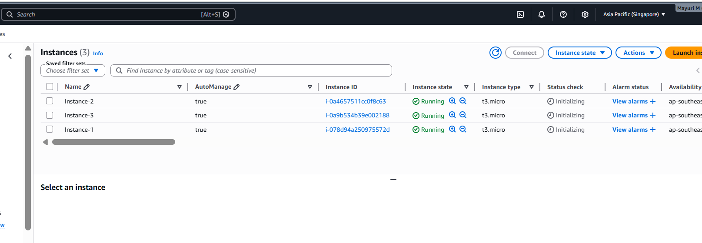
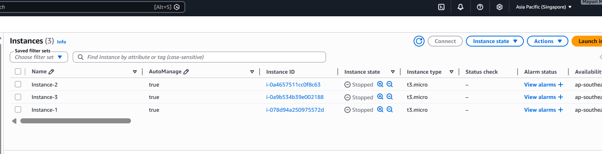
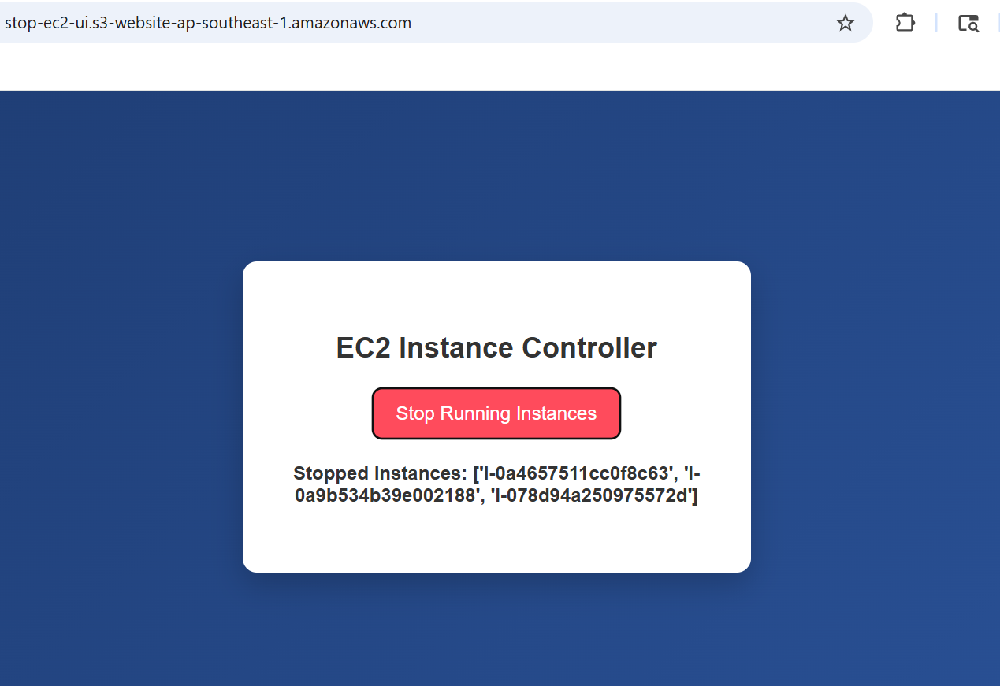
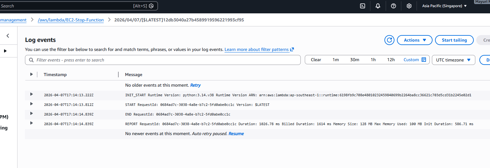

# 🚀 AWS EC2 Automation using Lambda, API Gateway & S3

---

## 📌 Problem Statement

Manually stopping EC2 instances after usage can lead to unnecessary AWS costs.
This project provides a simple web-based solution to stop running EC2 instances using a serverless architecture.

---

## 🧠 Solution Overview

Built a serverless application that allows users to:

* Stop EC2 instances via a web UI
* Secure API using API Gateway with API Key
* Perform backend automation using AWS Lambda
* (Future) Automate operations using scheduled triggers

---

## 🏗️ Architecture



---

## ⚙️ AWS Services Used

* AWS Lambda
* Amazon API Gateway
* Amazon S3 (Static Website Hosting)
* Amazon EC2
* AWS IAM

---

## 🔧 Implementation Steps

### 1. Lambda Function

* Created Lambda function using Python (boto3)
* Fetches EC2 instances with tag:

```
AutoManage = true
```

* Stops only running instances



---

### 2. API Gateway

* Created REST API
* Method: POST
* Enabled API Key for secure access
* Integrated API with Lambda




---

### 3. Frontend (S3 Static Hosting)

* Created simple HTML UI
* Hosted using S3 static website hosting




---

### 4. EC2 Setup

* Created EC2 instances
* Added tag:

```
AutoManage = true
```

* Tested stopping instances via UI




---

## 🧪 Testing

1. Open S3 website URL
2. Click **Stop Running Instances**
3. API Gateway triggers Lambda
4. Lambda stops running EC2 instances



---

## 🔐 Security

* API secured using API Key
* IAM roles used for Lambda permissions

---

## 💡 Key Learnings

* Serverless architecture design
* API Gateway + Lambda integration
* Handling CORS issues
* Hosting static website on S3
* Working with EC2 automation

---

## 🚀 Future Enhancements

* ⏰ Automate EC2 start/stop using EventBridge
* ▶️ Add "Start Instances" button
* 📊 Show instance status on UI
* 🔐 Add authentication (AWS Cognito)
* 📈 Add monitoring dashboard

---

## 📸 Logs



---
